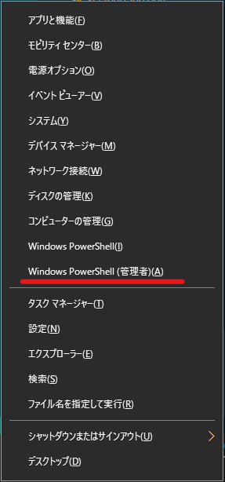
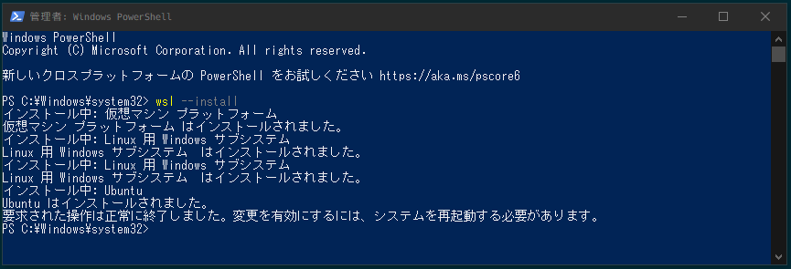
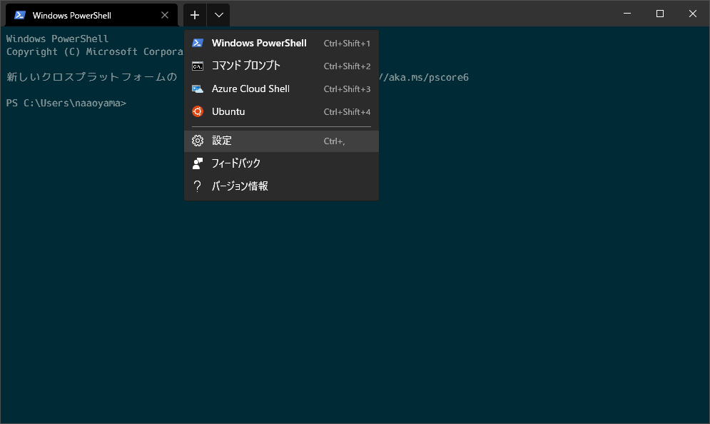
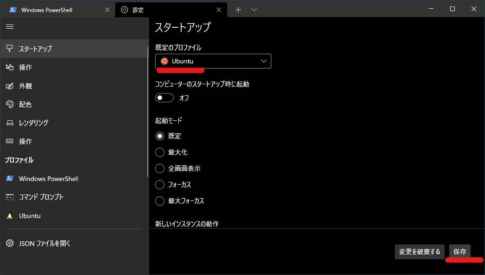
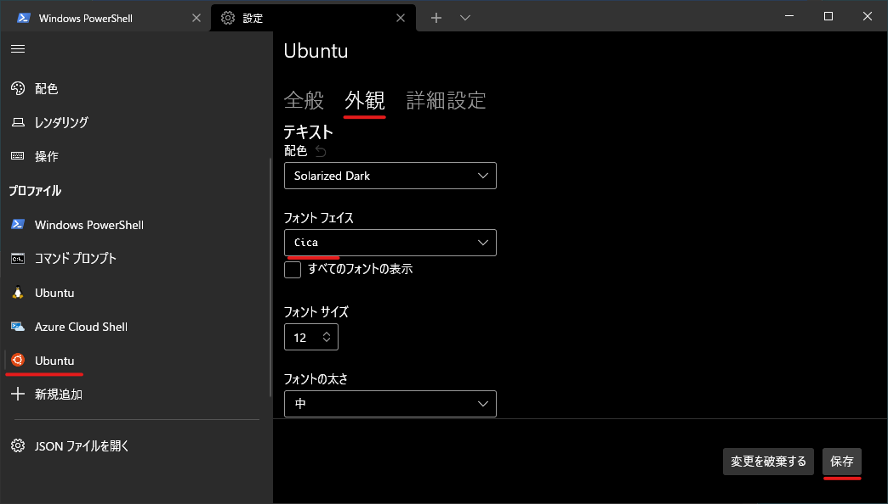
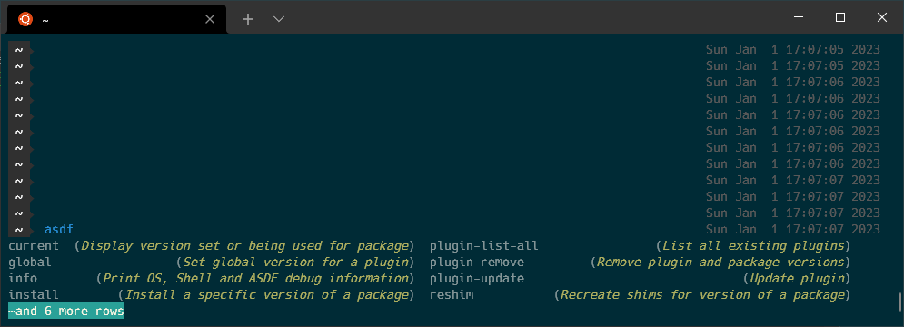
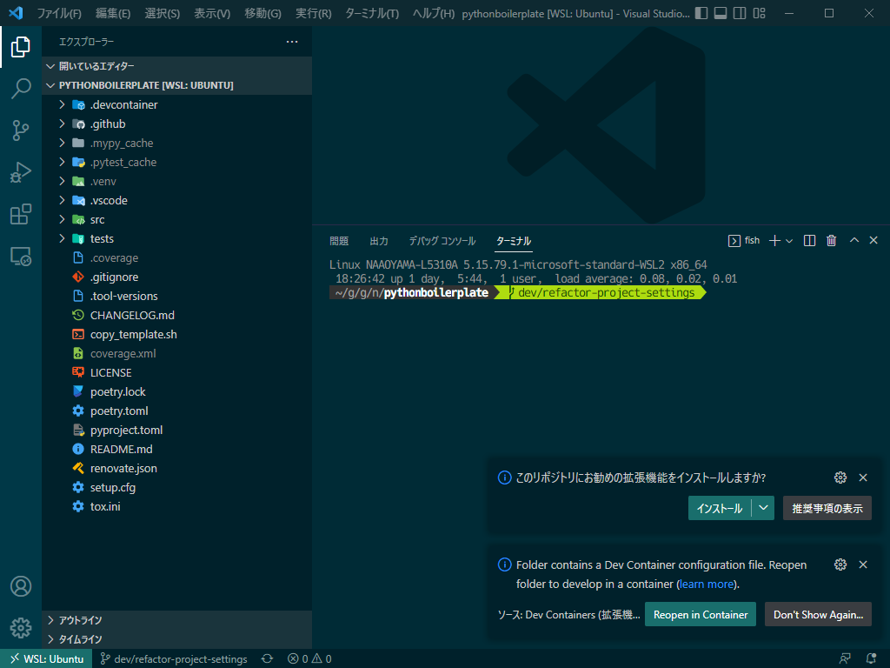
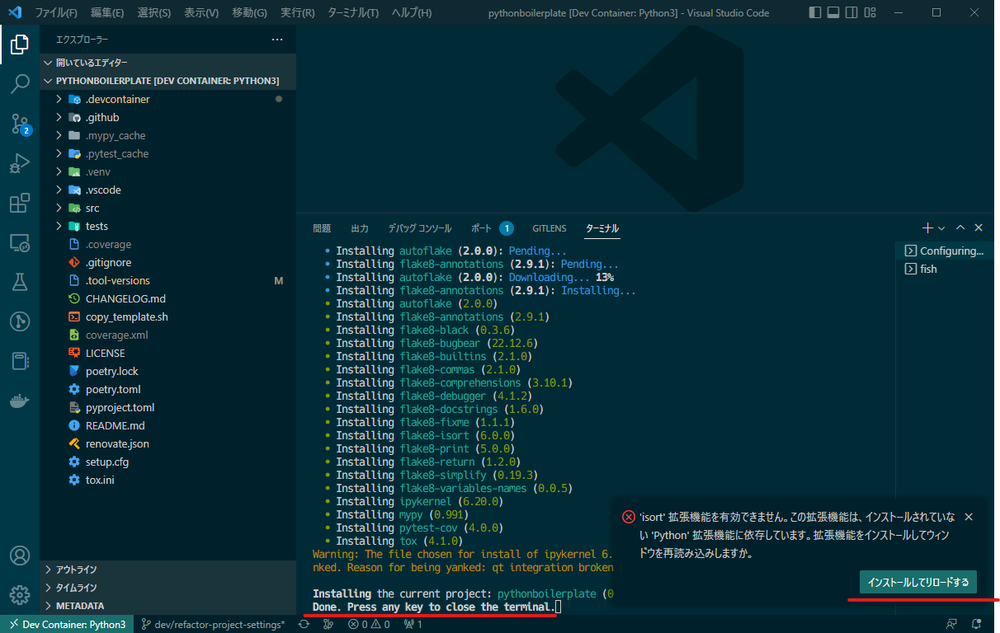
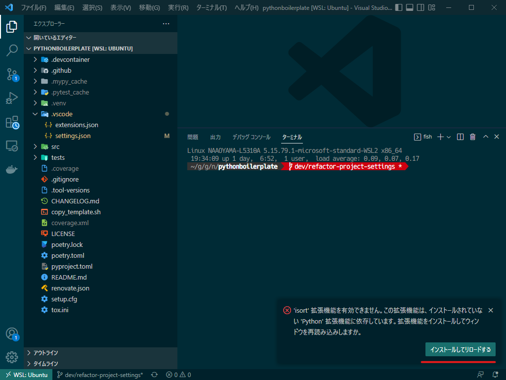

# Tutorial

プロジェクトを触る場合の初期セットアップをまとめる。  
所要時間は2-3時間となる、途中PCを再起動する必要が出るため再起動しても問題ない状態にすること  
対象の環境としては、一般業務環境を想定しているため下記とする

* Windows 10 Pro 22H2
* スペック
    * CPU: 4 Core 以上
    * CPU仮想化支援: 有効
    * メモリー: 16GB 以上
    * SSD(M.2): 256GB 以上

今回の構成では Docker Desktop を使わない方法で構築するため Windows + WSL2 + Docker + VSCode となる。  
そのためメモリーの要求が高い、また WSL2 から Hyper-V 上に 仮想マシンとして起動するため WSL2 に割り当てられるメモリーも Windows が稼働しているPCのメモリーとなる。

WSL2 は「PC本体のメモリーサイズの50%か8GBのどちらか少ない方」がデフォルトで割り当てられる

| PCのメモリー | WSL2のメモリー |
| -----------: | -------------: |
|          8GB |            4GB |
|         16GB |             8B |
|         32GB |            8GB |


ソフトウェアとして下記を使うので申請などがある場合は済ませる

| name             | URL                                                                                                         |
| :--------------- | :---------------------------------------------------------------------------------------------------------- |
| VSCode           | https://code.visualstudio.com                                                                               |
| Windows Terminal | https://apps.microsoft.com/store/detail/windows-terminal/9N0DX20HK701?hl=ja-jp&gl=jp&icid=TopNavWindowsApps |

## WSL2 の準備

Ref: https://learn.microsoft.com/en-us/windows/wsl/install

「Windowsキー」+「X」を押して左端に出てきた物から「Windows PowerShell (管理者)」を選択 PowerShell を起動する
追加で画面が表示されたら「OK」をクリック PowerShell が起動する。



起動した PowerShell に下記のコマンドを入力

```powershell
wsl --install

```



**PCを再起動する**

再起動が完了すると自動的に「Ubuntu」と書かれたウインドウが表示されるので少し待つ  
待っていると「Enter new UNIX username: 」を表示されるので好きな名前を入力し、  
次に「New password: 」と表示されるのでパスワードを入力、
「Retype new password: 」と表示されるのでパスワードを再度入力

```bash
Installing, this may take a few minutes...
Please create a default UNIX user account. The username does not need to match your Windows username.
For more information visit: https://aka.ms/wslusers
Enter new UNIX username: naa0yama
New password:
Retype new password:
passwd: password updated successfully
Installation successful!
To run a command as administrator (user "root"), use "sudo <command>".
See "man sudo_root" for details.

Welcome to Ubuntu 22.04.1 LTS (GNU/Linux 5.15.79.1-microsoft-standard-WSL2 x86_64)

 * Documentation:  https://help.ubuntu.com
 * Management:     https://landscape.canonical.com
 * Support:        https://ubuntu.com/advantage

This message is shown once a day. To disable it please create the
/home/naa0yama/.hushlogin file.
naa0yama@NAAOYAMA:~$

```

起動したプロンプトで `cat /etc/lsb-release` を入力して `DISTRIB_RELEASE=22.04` となっていることを確認する。

```bash
$ cat /etc/lsb-release
DISTRIB_ID=Ubuntu
DISTRIB_RELEASE=22.04
DISTRIB_CODENAME=jammy
DISTRIB_DESCRIPTION="Ubuntu 22.04.1 LTS"
```

WSL2 の導入はここまで

## 初期設定

OSの設定とアップデートを実施する。

```bash
sudo apt update && sudo apt upgrade -y

```

その後、 systemd を利用したいので下記のファイルを作成

```bash
cat << EOF | sudo tee /etc/wsl.conf >> /dev/null
[automount]
enabled    = true
mountFsTab = true
root       = "/mnt/"
options    = "metadata,uid=1000,gid=1000,umask=0022"

[boot]
systemd    = true

EOF

```

PowerShell を最初の方法で開き下記を入力
`wsl --list --verbose` を入力し `STATE` が `Stopped` になることを確認する

```powershell
PS C:\Windows\system32> wsl --shutdown

PS C:\Windows\system32> wsl --list --verbose
  NAME      STATE           VERSION
* Ubuntu    Running         2

PS C:\Windows\system32> wsl --list --verbose
  NAME      STATE           VERSION
* Ubuntu    Stopped         2
PS C:\Windows\system32>
```

上記問題なければ、 スタートなので「Ubuntu」を検索し起動 Ubuntu のターミナルを起動する。  
`pgrep -a systemd` で systemd が上がっていることが確認できる。

```bash
$ pgrep -a systemd
1 /sbin/init
34 /lib/systemd/systemd-journald
58 /lib/systemd/systemd-udevd
90 /lib/systemd/systemd-resolved
138 /lib/systemd/systemd-logind
462 /lib/systemd/systemd --user

```

## Docker Engine のインストール

[Install Docker Engine on Ubuntu \| Docker Documentation](https://docs.docker.com/engine/install/ubuntu/)

* Uninstall old versions

古い docker があると良くないのでいったんすべてアンインストールする

```bash
sudo apt-get remove docker docker-engine docker.io containerd runc

```

* apt で使う依存関係をインストール

```bash
sudo apt-get update
sudo apt-get install \
    ca-certificates \
    curl \
    gnupg \
    lsb-release

```

* GPG Key をインストールする

```bash
sudo mkdir -p /etc/apt/keyrings
curl -fsSL https://download.docker.com/linux/ubuntu/gpg | sudo gpg --dearmor -o /etc/apt/keyrings/docker.gpg

```

* Docker レポジトリーの登録

```bash
echo \
  "deb [arch=$(dpkg --print-architecture) signed-by=/etc/apt/keyrings/docker.gpg] https://download.docker.com/linux/ubuntu \
  $(lsb_release -cs) stable" | sudo tee /etc/apt/sources.list.d/docker.list > /dev/null

```

* Docker のインストール

```bash
sudo apt-get update

```

```bash
sudo apt-get install docker-ce docker-ce-cli containerd.io docker-compose-plugin

```

* Docker バージョンの確認

```bash
$ docker --version
Docker version 20.10.22, build 3a2c30b

```

* systemd で Docker が動いてるか確認

systemd で起動していて、 Enable もされてるので自動起動も設定されている。

```bash
$ systemctl is-enabled docker
enabled

$ systemctl status docker
● docker.service - Docker Application Container Engine
     Loaded: loaded (/lib/systemd/system/docker.service; enabled; vendor preset: enabled)
     Active: active (running) since Sun 2023-01-01 12:49:42 JST; 3min 28s ago
TriggeredBy: ● docker.socket
       Docs: https://docs.docker.com
   Main PID: 2035 (dockerd)
      Tasks: 13
     Memory: 29.1M
     CGroup: /system.slice/docker.service
             └─2035 /usr/bin/dockerd -H fd:// --containerd=/run/containerd/containerd.sock

```

* 自身のユーザーを docker グループに所属させる

```bash
sudo usermod -aG docker $USER

```

## SSH の設定

Git などでファイルにアクセスするために SSH の設定が必要になる。  
自前のSSHキーがある場合はそれを設定する

ない場合は下記を参考

* `ssh-keygen` を実行して何も入力しなくてよい、、パスフレーズが必要な職場の場合は設定する
* `ls -lah ~/.ssh/` して鍵があれば問題ない

```bash
$ ssh-keygen
Generating public/private rsa key pair.
Enter file in which to save the key (/home/naa0yama/.ssh/id_rsa):
Created directory '/home/naa0yama/.ssh'.
Enter passphrase (empty for no passphrase):
Enter same passphrase again:
Your identification has been saved in /home/naa0yama/.ssh/id_rsa
Your public key has been saved in /home/naa0yama/.ssh/id_rsa.pub
The key fingerprint is:
SHA256:9+g/0eR3nMfOAxEZ4q7hCftw+BNgJwJBxFa0AUn3o7Q naa0yama@PC
The key's randomart image is:
+---[RSA 3072]----+
|  =**=     . .o  |
|   =. +   . .o   |
|  . .o o   .  .  |
|    ..o+...  ..  |
|     Eo.S... +.o.|
|        =o+o..o.*|
|       + =o ...+o|
|        =o  .  .o|
|         oo...  .|
+----[SHA256]-----+

$ ls -lah ~/.ssh/
total 16K
drwx------ 2 naa0yama naa0yama 4.0K Jan  1 13:21 .
drwxr-x--- 5 naa0yama naa0yama 4.0K Jan  1 13:21 ..
-rw------- 1 naa0yama naa0yama 2.6K Jan  1 13:21 id_rsa
-rw-r--r-- 1 naa0yama naa0yama  578 Jan  1 13:21 id_rsa.pub

```

`id_rsa.pub` を各 Git のサービスに登録して完了。

## fish-shell のインストール

[fish shell](https://fishshell.com/)

fish-shell の導入は任意だが、筆者の開発環境はすべて利用しており、コマンドの補完が強力で手放せないためセットアップする

PPA でインストールするので下記となる

```bash
sudo apt-add-repository ppa:fish-shell/release-3

```

```bash
sudo apt update
sudo apt -y install fish

```

途中で `[ENTER]` を求められるので押す

```bash
$ sudo apt-add-repository ppa:fish-shell/release-3
[sudo] password for naa0yama:
Repository: 'deb https://ppa.launchpadcontent.net/fish-shell/release-3/ubuntu/ jammy main'
Description:
This archive contains releases made from the Fish 3.x series.

To install fish, run the following commands:

sudo apt-add-repository ppa:fish-shell/release-3
More info: https://launchpad.net/~fish-shell/+archive/ubuntu/release-3
Adding repository.
Press [ENTER] to continue or Ctrl-c to cancel.
Adding deb entry to /etc/apt/sources.list.d/fish-shell-ubuntu-release-3-jammy.list
Adding disabled deb-src entry to /etc/apt/sources.list.d/fish-shell-ubuntu-release-3-jammy.list
Adding key to /etc/apt/trusted.gpg.d/fish-shell-ubuntu-release-3.gpg with fingerprint 59FDA1CE1B84B3FAD89366C027557F056DC33CA5
Hit:1 http://archive.ubuntu.com/ubuntu jammy InRelease
Get:2 https://ppa.launchpadcontent.net/fish-shell/release-3/ubuntu jammy InRelease [17.6 kB]
Get:3 http://archive.ubuntu.com/ubuntu jammy-updates InRelease [114 kB]
Get:4 http://security.ubuntu.com/ubuntu jammy-security InRelease [110 kB]
Hit:5 https://download.docker.com/linux/ubuntu jammy InRelease
Get:6 http://archive.ubuntu.com/ubuntu jammy-backports InRelease [99.8 kB]
Get:7 https://ppa.launchpadcontent.net/fish-shell/release-3/ubuntu jammy/main amd64 Packages [572 B]
Get:8 https://ppa.launchpadcontent.net/fish-shell/release-3/ubuntu jammy/main Translation-en [288 B]
Fetched 343 kB in 5s (65.3 kB/s)
Reading package lists... Done

```

* デフォルト shell を変更する

```bash
chsh -s $(type -p fish)

```

**Shell を再起動する**

再起動後このような表示になればおけ

```bash
Welcome to fish, the friendly interactive shell
Type help for instructions on how to use fish
naa0yama@PC ~>

```

### fisher

fisher をインストールする。これは、 fish-shell のプラグインマネージャーである。  
後ほどインストールする `ghq`, `fzf` など便利ツールのプラグインが配布されているため利用する

[jorgebucaran/fisher: A plugin manager for Fish\.](https://github.com/jorgebucaran/fisher)

Shell を開き下記を入力してインストールする

```bash
curl -sL https://git.io/fisher | source && fisher install jorgebucaran/fisher

```

* Plugin のインストール

特にないが、下記を推奨とする

```bash
fisher install decors/fish-ghq
fisher install oh-my-fish/theme-bobthefish
fisher install jethrokuan/fzf

```

## 等幅フォント

日本人としては漢字で生きていきたいが、そうもいかずソースコード上では英数字と日本語が交じることもあるでしょう。そうなった場合文字のフォントが良くないと表示がずれたり、端が揃わないや、可読性が悪いなどの状態となることがあるため、英数字:1 対 日本語:2 の「等幅(とうはば)」フォントというのがある。

私は何個か使い歩いてはいるがフォントファイルに、太字(Bold)、太字斜体(BoldItalic)、斜頸(RegularItalic)、標準(Regular)が用意されているのはなかなかないためこれに落ち着いた。

下記リリースページからダウンロードして解答後、右クリック「インストール」でインストールできる
4つのフォントが同梱されているためすべてインストールしておく。

※ファイルは `Cica_vX.X.X.zip` で問題ない

[Releases · miiton/Cica](https://github.com/miiton/Cica/releases)


## Windows Terminal の設定

Windows Terminal は必須ではないが、 fish-shell は多くの Unicode 文字を使うことがあり文字化けとなることがあるためフォントを変更して使うため推奨する

[Windows Terminal](https://apps.microsoft.com/store/detail/windows-terminal/9N0DX20HK701?hl=ja-jp&gl=jp&icid=TopNavWindowsApps) の Store からインストールする

* 起動し、「設定」をクリック



* 「既定のプロファイル」を「Ubuntu」に変更する
* 「保存」をクリック




* 「Ubuntu」をクリック
* 「外観」をクリック
* 「配色」をお好みで選択
* 「フォントフェイス」で「Cica」を選択
* 「保存」をクリック



これで次回起動時に Ubuntu が起動するので、タスクバーなどに「Windows Terminal」をピン止めしておけば素早くアクセスできる。

## asdf のインストール

asdf は様々な開発ツールのバージョンを分離的に導入、プロジェクトごとに使用バージョンを変えることができる。  
今回は `python`, `poetry`, `ghq` を対象に導入するが、 `awscli`,`aws-sam-cli`,`terraform` などにも対応している。

公式マニュアルを参考とする
[Getting Started \| asdf](https://asdf-vm.com/guide/getting-started.html#_1-install-dependencies)


* 依存関係のインストール

```bash
sudo apt install -y curl git

```

* 本体のダウンロード

```bash
git clone https://github.com/asdf-vm/asdf.git ~/.asdf --branch v0.10.2

```

* 設定
    * `~/.config/fish/config.fish` を適当なエディターで開き最下行に下記を追加する

```bash
#- -----------------------------------------------------------------------------
#- asdf
#- -----------------------------------------------------------------------------
source ~/.asdf/asdf.fish

```

* 補完の構成

fish-shell の補完を設定する

```bash
mkdir -p ~/.config/fish/completions; and ln -s ~/.asdf/completions/asdf.fish ~/.config/fish/completions

```

* docker の補完ファイルを導入

```bash
curl https://raw.githubusercontent.com/docker/cli/master/contrib/completion/fish/docker.fish -o ~/.config/fish/completions/docker.fish  

```

* 設定を確認する

shell を再読み込みさせて動作を確認する

```bash
exec $SHELL -l

```

```bash
asdf <Tab を入力すると表示される>

```




### Python

* Python の依存関係を追加する
  * Ref: [Home · pyenv/pyenv Wiki](https://github.com/pyenv/pyenv/wiki#suggested-build-environment)

```bash
sudo apt update; sudo apt install build-essential libssl-dev zlib1g-dev \
libbz2-dev libreadline-dev libsqlite3-dev curl llvm \
libncursesw5-dev xz-utils tk-dev libxml2-dev libxmlsec1-dev libffi-dev liblzma-dev

```

* Python のプラグインを追加

```bash
asdf plugin-add python

```

* Python のバージョンを追加

```bash
asdf install python 3.10.8

```

下記のコマンドで、 Global (そのユーザーのデフォルト) Python バージョンを決定する。  
Shell 上では、 asdf が読み込まれてる限り適用されるので最初に実施すること

* global 設定

```bash
asdf global python 3.10.8

```

### Poetry

* Poetry のプラグインを追加

```bash
asdf plugin add poetry

```

* Poetry のインストール

`No version is set for command python3` と出た場合 python の global 設定を確認しましょう

```bash
asdf install poetry <version>

```

* global 設定

```bash
asdf global poetry <version>

```


### GHQ インストール

GHQ は git clone を賢くしてくれるツールです。  
具体的には、提供元のサーバーやプロジェクトごとにフォルダーを自動で作成し git clone してくれます  
下記は2つのプロジェクトを `ghq get` したところですこれを `ghq get` するだけできます。

* git@github.com:ansible/vscode-ansible.git
* git@github.com:naa0yama/pythonboilerplate.git

```bash
$ tree ~/ghq/ -d -L 4
/home/naa0yama/ghq/
└── github.com
    └── ansible
        └── vscode-ansible
    └── naa0yama
        └── pythonboilerplate

```

* GHQ の依存関係と、プラグインのインストール

```bash
sudo apt -y install unzip

asdf plugin add ghq

```

* GHQ のインストール

```bash
asdf install ghq latest

```

* global 設定

```bash
asdf global ghq latest

```

### asdf の使い方

* **そのディレクトリ、プロジェクトで version を選択する方法**

asdf では複数バージョンがインストールでき、それをディレクトリ、global で変更できるのが強みです。
そのため、 Git などで管理されるプロジェクトディレクトリに `.tool-versions` を設置することでチーム全体の version を合わせることができます。

プロジェクトでのみ変更したい場合か下記のようにします

```bash
asdf local <plugin name> <version>

```

グローバルに変更したい場合は下記のようにします

```bash
asdf global <plugin name> <version>

```


* **そのディレクトリで利用しているバージョンの確認(`asdf current`)**

asdf は `.tool-versions` のファイルで version を管理してます。  
そのファイルが見つかるまでディレクトリを遡り、参照するため `asdf global` を設定すると  
最終的に、ユーザーのホームディレクトリまで来ます。  
そのため、コマンドを打つディレクトリによって結果が変わるため確認する癖をつけましょう。

`asdf current` を打つとそのディレクトリでどのバージョンを使っているか確認できます。  
下記の場合は、 `~/tmp` ディレクトリでコマンドを打ちましたので Python のバージョンが  
`3.10.8` が採用されています。

```bash
$ pwd
/home/naa0yama/tmp

$ asdf current
ghq             1.3.0           /home/naa0yama/.tool-versions
poetry          1.1.15          /home/naa0yama/.tool-versions
python          3.10.8          /home/naa0yama/tmp/.tool-versions

```


## fzf

fzf はコマンド結果をインタラクティブに検索できるツールです下記でインストールできます。

```bash
sudo apt -y install fzf

```

便利なショートカットが下記です。

|        |                                                                   |
| :----- | :---------------------------------------------------------------- |
| Ctrl+G | ghq を使って `~/ghq` 配下のプロジェクトを検索、開くことができます |
| Ctrl+R | history を検索できます                                            |


## Git の設定

開発プロジェクトは Git で管理されているため Git の設定をする

```bash
git config --global user.name "First-name Family-name"
git config --global user.email "username@example.com"

git config --global color.diff auto
git config --global color.status auto
git config --global color.branch auto
git config --global push.default simple

```

## git-secrets のインストール

AWS の アクセスキー(Accesskey)やシークレットキー(SecretKey)を Git へコミットしないための設定をする。通常の方法だと、プロジェクトごとに設定しなければならないため全体で禁止する。

* インストール
    * `ghq get https://github.com/awslabs/git-secrets.git` を打って clone
    * Ctrl+R のショートカットキーを入力し プロジェクトへ移動
    * `sudo make install` を実行する
    * コマンドが正常に終了したら<br>`git secrets --register-aws --global` を実行して完了

---
## VSCode のインストール

[Visual Studio Code](https://code.visualstudio.com/) をサイトを参考にインストールします。

インストール後に [Remote Development \- Visual Studio Marketplace](https://marketplace.visualstudio.com/items?itemName=ms-vscode-remote.vscode-remote-extensionpack) を開き、 「Install」 を押し「Visual Studio Code を開く」をクリック VSCode が開き拡張機能が表示されたら、「インストール」をクリックしてインストールしてください

---
## 使い方

使い方は、下記の2種類があり両方説明する。

1. 開発コンテナを利用する方法
   * メリット
         * チュートリアルをこなしてきた環境さえあれば、開発・利用ができる。
     * デメリット
         * 一度に2つのプロジェクトを開くなどはできないためプロジェクト分、VSCode を起動する必要がある。
2. 手元の環境で開発する方法
    * メリット
        * WSL2 の環境上で動作するので自分がカスタムした設定やコマンドも利用できる
    * デメリット
        * 開発環境を維持、利用するのにある程度の知識技能が必要

---

### 1. 開発コンテナを利用する方法


まずは WSL2 を起動して、プロジェクトの Git を `ghq get` する

```bash
ghq get git@github.com:naa0yama/pythonboilerplate.git

```


その後、 Ctrl+G のショートカットを入力し該当プロジェクトを選択してプロジェクト配下に移動  
`code .` を入力することで、 VSCode をこのプロジェクト配下で起動できる。

```bash
code .

```

下記の画面が出る場合は「はい、作成者を信頼します」を押して信頼してください。  
外部の方が作ったよくわからない物などは「いいえ」でも閲覧可能ですが拡張機能が動作しないなどとなります。


許可した後に、「Folder contains a Dev Container～」と出るので「Reopen in Container」をクリック  




下記のように「isort」の警告が出た場合は、裏で稼働してる poetry のインストールが完了し  
「Done. Press any key to close the terminal.」が表示されるまで待ってからクリックすること




上記のボタン操作後、再読み込みが完了すればすぐに開発が開始できる。

---

### 2. 手元の環境で開発する方法

まずは WSL2 を起動して、プロジェクトの Git を `ghq get` する

```bash
ghq get git@github.com:naa0yama/pythonboilerplate.git

```


その後、 Ctrl+G のショートカットを入力し該当プロジェクトを選択してプロジェクト配下に移動  
`code .` を入力することで、 VSCode をこのプロジェクト配下で起動できる。

```bash
code .

```

下記の画面が出る場合は「はい、作成者を信頼します」を押して信頼してください。  
外部の方が作ったよくわからない物などは「いいえ」でも閲覧可能ですが拡張機能が動作しないなどとなります。


許可した後に、「このレポジトリにお勧めの拡張機能をインストールしますか?」と出るので「インストール」をクリック  

下記が表示される場合は「インストールしてリロードする」をクリック



再読み込みが完了したらターミナルで確認します。  
以下の結果でこのプロジェクトは `python 3.10.8`, `poetry 1.3.1` を利用していることがわかるので
自分の環境にない場合は `asdf` のセットアップ時の手順を確認しインストールしてください。

```bash
$ asdf current
ghq             1.3.0           /home/naa0yama/.tool-versions
poetry          1.3.1           /home/naa0yama/ghq/github.com/naa0yama/pythonboilerplate/.tool-versions
python          3.10.8          /home/naa0yama/ghq/github.com/naa0yama/pythonboilerplate/.tool-versions
```

利用するソフトウェアの version が揃っていることを確認できたら、 python の `.venv` を作成します。  

```bash
poetry env use 3.10
poetry install

```

インストールが完了したら、 Ctrl+Alt+P のショートカットをして `Python: Clear Cache and Reload Window` を選択して再読み込みこれで `.venv` が読み込まれて使えるようになる。

* 確認

`src/pythonboilerplate/__init__.py` のファイルを開き右下を確認する
`3.10.8 ('.venv': poetry)` のようになっていれば正常に機能している。


